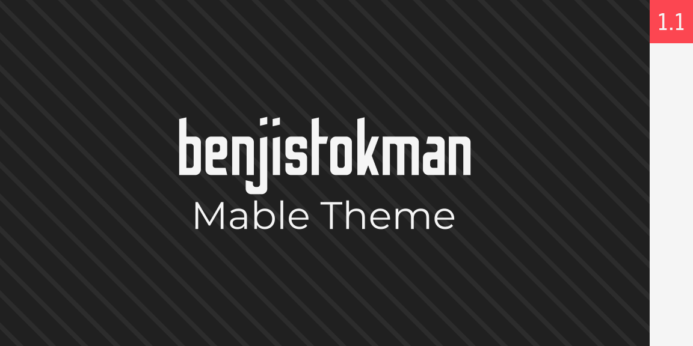

# Benjistokman Mable theme

This is a theme for the [Mable](https://mablesite.com) standard.

MIT License.

## Summary of Theme-Specific Classes

`.benjistokman-emphasis`: creates an outline for the section.

`.benjistokman-background-one`, `.benjistokman-background-two`, `.benjistokman-background-three`, `.benjistokman-background-four`: special repeating backgrounds. Uses an appropriate colored version based off the section coloring.